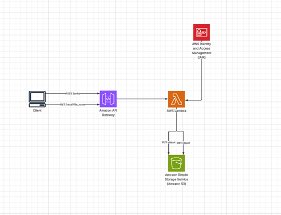

# WizTask Infrastructure Deployment

## Overview

This project provisions a serverless AWS infrastructure using Terraform. It includes:
- An S3 bucket for data storage.
- An AWS Lambda function for processing requests.
- An API Gateway with endpoints to trigger the Lambda.
- IAM roles and policies for secure access.

---

## Architecture



- **Client**  
  Sends HTTP requests:  
  - `POST /write` – stores data  
  - `GET /read?file_name=` – retrieves data

- **Amazon API Gateway (v2)**  
  Receives HTTP requests and forwards them to Lambda. Returns the response to the client.

- **AWS Lambda**  
  Executes the logic: receives the request, reads from or writes to S3, and returns a response to API Gateway.

- **Amazon S3**  
  Stores the files. Access is restricted only to the Lambda function's IAM role.

- **IAM**  
  Provides secure access. The bucket policy ensures that only the Lambda role can access S3.


---

## Prerequisites

- [Terraform](https://www.terraform.io/downloads.html) v1.10.5 or newer
- [AWS CLI](https://aws.amazon.com/cli/) configured with a profile (e.g., `default`)
- Python 3.8+ (for running `run.py`)
- AWS credentials **must not** be hardcoded. Use environment variables or AWS CLI profiles.

---

## Deployment Instructions

1. **Clone the repository:**
   ```sh
   git clone <repo-url>
   cd WizTask/tf
   ```

2. **Initialize Terraform:**
   ```sh
   terraform init
   ```

3. **Review and apply the plan:**
   ```sh
   terraform plan
   terraform apply
   ```
   Confirm with `yes` when prompted.

4. **Outputs:**
   - Terraform will output the API Gateway endpoint after deployment.

---

### Lambda Function

This project uses an AWS Lambda function with the **Python 3.11** runtime.  
The Lambda is managed using the official [Terraform AWS Lambda module](https://github.com/terraform-aws-modules/terraform-aws-lambda), which simplifies deployment and configuration of Lambda functions via Terraform.

For more details about the module and its options, see the [Terraform AWS Lambda module documentation](https://github.com/terraform-aws-modules/terraform-aws-lambda).
## Lambda Function & API Endpoints

The Lambda function is written in Python and deployed via Terraform. It exposes two HTTP endpoints through API Gateway **v2**:

- **GET `/read`**  
  Takes a `file_name` query parameter and returns the file contents from the S3 bucket.

- **POST `/write`**  
  Accepts a JSON payload and writes it to a file in the S3 bucket. Returns the generated file name.

Both endpoints are accessible via the API Gateway URL output by Terraform.

---

### IAM Role & Permissions

An IAM role is created specifically for the Lambda function. This role grants the Lambda function permissions to:
- Access the S3 bucket (read and write objects)
- Interact with API Gateway

The S3 bucket policy is configured to **deny access to all resources except the Lambda function**. Only the Lambda function, via its IAM role, is allowed to read from and write to the S3 bucket. This ensures secure and restricted access to your data.

---

## Testing the Infrastructure

A `run.py` script is provided to test the API endpoints.

1. **Install dependencies:**
   ```sh
   pip install -r requirements.txt
   ```

2. **Set the API Gateway URL:**
   - The `api_url` is automatically retrieved from the Terraform output using the command:
     ```sh
     terraform output -raw gateway_endpoint
     ```
   - The script uses this value to interact with the deployed API Gateway.
   - Alternatively, you can manually copy the API Gateway endpoint URL from the Terraform output and set it as an environment variable or update the `API_URL` variable in `run.py` if needed.

3. **Run the script:**
   ```sh
   python run.py
   ```

   The script will:
   - Send a POST request to `/write` with sample data.
   - Send a GET request to `/read` to retrieve data.

---

## Authentication

**Do not** include AWS credentials in any scripts or configuration files.

- Use the AWS CLI to configure your credentials:
  ```sh
  aws configure
  ```
- Or set environment variables:
  ```sh
  set AWS_ACCESS_KEY_ID=your-access-key-id
  set AWS_SECRET_ACCESS_KEY=your-secret-access-key
  set AWS_DEFAULT_REGION=eu-central-1
  ```

---

## Cleanup

To destroy all resources created by Terraform:
```sh
terraform destroy
```

---

## Notes

- All resources are tagged with `terraform = "true"` for easy identification.
- Ensure your AWS user/role has sufficient permissions to create and manage S3, Lambda, IAM, and API Gateway resources.

---

---

## CI/CD Automation (Optional)

An optional GitHub Actions workflow is included (`cicd_tf.yaml`) that enables automatic deployment of the Terraform infrastructure with support for region and workspace selection.  
This demonstrates how infrastructure changes can be managed through version-controlled pipelines.

> Note: This workflow is not required for the assignment but included to showcase CI/CD best practices.

## Documentation & References

- [API Gateway HTTP API Integration with Lambda (AWS Docs)](https://docs.aws.amazon.com/apigateway/latest/developerguide/http-api-develop-integrations-lambda.html)
- [Terraform AWS API Gateway v2 Module](https://github.com/terraform-aws-modules/terraform-aws-apigateway-v2)
- [Terraform AWS Lambda Module Variables](https://github.com/terraform-aws-modules/terraform-aws-lambda/blob/master/variables.tf)
- [API Gateway HTTP API CORS (AWS Docs)](https://docs.aws.amazon.com/apigateway/latest/developerguide/http-api-cors.html)
- [Boto3 S3 Client Documentation](https://boto3.amazonaws.com/v1/documentation/api/latest/reference/services/s3.html)